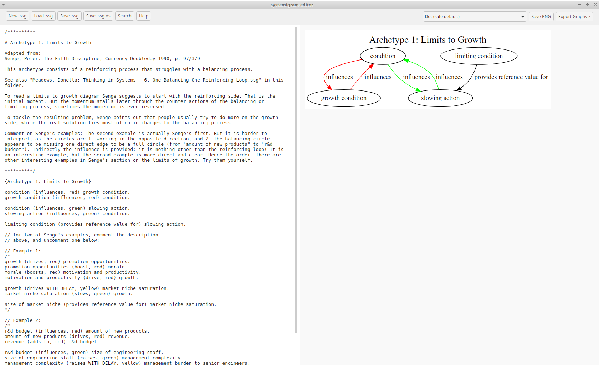
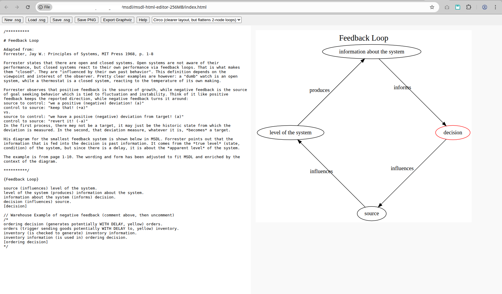
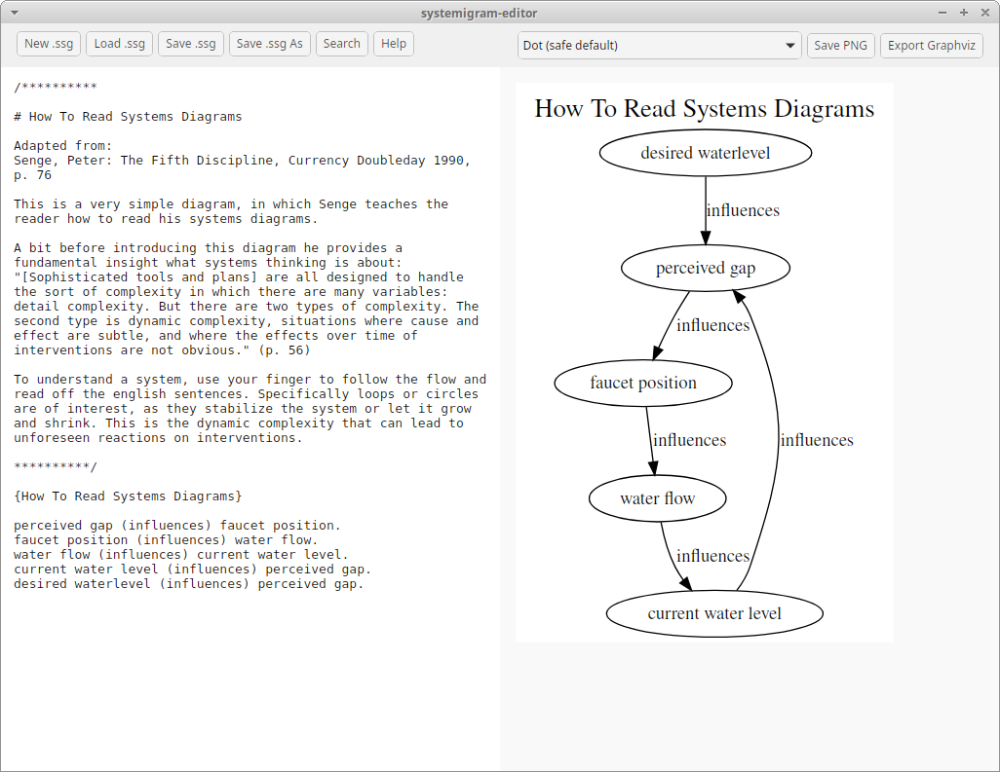

# What is this good for?

This repo contains MSDL, the Minimal Systemigram Description Language.

It consists of specs, editors, and a pattern library of examples from the systems thinking literature.

You may be interested if one of the following applies to you:

- You want to learn systems thinking

- You are a systems thinking practicioner, and have not found a good description language to build systemigrams, or lack an editor

- You teach systems thinking

# A Picture is Worth a Thousand Words

## Wails Editor (Linux, Mac, Windows)

On the left side an example of MSDL from the SysPatLib, on the left side the generated diagram. Systemigram rendered by dot, which is the default renderer because it creates systemigrams that are ok for almost any use case.

## Offline HTML Editor

Systemigram rendered with circo, which is clearer, but flattens two-node-loops. That's why it has not been made default in the first version of the editor.

# A GitHub Page is Worth Even More Than a Thousand words

Try the editor here: [Systemigram Editor](https://stefankober.github.io/minimal-systemigram-description-language/)

The help page will give you a good overview of what this project is about.

From here you can jump to:

[Download Section](#local-apps)

[Repo Structure, Dependencies and Licensing](#repo-structure-dependencies-and-licensing)

Or you can read:

# A Very Short Introduction To Systems Thinking And Structured Systemigrams

To explain systems thinking, one of the best places to start at is the definition of a system, more precisely the **Oops-definition of a system**.

It’s found in hindsight: **You discover it’s a system when your intervention causes
an unintended outcome somewhere else**.

Most often the outcome is not favorable. 

Traps are a prime example of systems, and a prime example of why systems thinking matters. Traps are systems designed to conceal the Oops-moment by putting something else in focus or camouflaging as unsuspicious.

And that is why you need systems thinking. To understand the often complex and feedback based setup of what you are dealing with, to understand what your intervention will cause, or even what the real problem is in the first place.

Here is an image showcasing how a diagram can help reason about systemic problems, and what MSDL looks like (after the comment /\*...\*/). The example is from SysPatLib.

A more formal definition is this: **A system is a collection of interacting parts that form a whole.**

The idea of interacting parts is usually easy to understand. We have everyday experience with the meaning of "interaction" and "part".

That they must form a whole can also be unproblematic. Small machines are sold as whole things that can be carried around. Some of their parts can be replaced and reused and form systems of their own, like motors. They have an inside that is clearly separated from the outside, usually even physically to minimize outside influence.
For many systems however boundaries, inside and outside are not so simple to inspect.

How can we for large scale social or natural systems find out if they form a whole? It can be an elusive concept. "Part" usually means "part of a whole", but that whole can still be hard to pinpoint, even though we know that this part, for example a screw, is not made to work standalone, and is thus a part of something. "Part" is more accessible than "whole".

There are three broad strategies to make a whole visible:

First of all: interconnections and their boundaries, as witnessed by ripple effect, loops, changes in one part changing the behavior of other parts and the whole. Where these effects end is the boundary of the whole.

Second: A system can have a purpose as a whole, usually because it was designed to serve that purpose. The tools we talked about, they serve a purpose in the way that the parts act together to achieve that purpose. And once they stop achieving that purpose for good, that system is broken and needs to be fixed or replaced when the purpose still exists. Parts in isolation cannot serve the purpose. A computer monitor on its own is pretty useless, as is a desktop computer without a monitor.

Third: A system can achieve something as a whole. This is related to purpose, but not the same. A system can achieve something without being designed for it. It can play a role that nobody has written for it, but that we still can ascertain, like the system of bees and blossoms. That system, planned by nobody, delivers honey and fruit, and it is crucial to the survival of the whole ecosystem. The parts that cannot be taken away without destroying the achievement are the system's vital parts.

# How Systems Thinking is Different

Systems thinking differs from discursive or logical reasoning.

Discursive reasoning is local: if you have a set of propositions and valid connectors, you can derive a conclusion without knowing anything about the wider context.

Logic is symbolic, mostly text-based. It works well for isolated truths, cause-effect chains, or deductive systems.

Systems thinking, by contrast, is about understanding the whole through the interactions of the parts. You need to keep one eye on local relations—and the other on distant, often delayed effects.

From the early days of systems thinking diagrams were a vital part of understanding systems. We don’t just use language to understand the system of interest—we use our eyes, and even our fingers, to trace the flow, follow the influence, and reveal the wider interaction.

It’s **applied synesthesia**, a way to think with more than just words, and a method for tackling hard problems with our whole attention.

# The Entry Barrier and Systemigrams

Most people speak and read fluently. But diagrams are another language entirely. For many, they are unfamiliar.

This creates a significant barrier to systems thinking. Without accessible visual tools, systemic reasoning often remains abstract, hard to teach, and even harder to share.

Boardman and Sauser recognized this challenge and attempted to overcome it by introducing the **systemigram**: a narrative-based diagram that visually expresses a system’s structure and dynamics (in their book *Systemic Thinking. Building Maps for Worlds of Systems, Wiley: 2013*).

They describe a systemigram as “both a diagram and a system” (p. 102), and elsewhere refer to it as a “graphical narrative of a system’s story” (paraphrased from multiple locations). The systemigram was meant to be readable, collaborative, and expressive—especially for complex social and organizational systems.

And in many ways, it succeeded. Systemigrams have lowered the entry barrier to systems thinking considerably. They made it possible to diagram complexity without requiring formal training in systems engineering or mathematical modeling.

But Boardman and Sauser also acknowledge the limitations of their method. Systemigrams are compelling, but often ambiguous. They rely on human judgment, author presence, and narrative interpretation. In the next section, we examine these limitations in more detail.

## 1. No local meaning. Semantics are distributed across the diagram.

Systemigrams follow a loose mapping from sentences to diagrams: noun phrases become nodes, and verb or prepositional phrases become connecting arrows (p. 163). But this transformation is largely judgment-based. Boardman and Sauser note that “not everything that could be said is chosen” (p. 163), and that attaching significance is “a matter of sound judgment by the systemigram creator.”

This flexibility allows the capture of rich narratives, but also creates ambiguity. There is no constraint on sentence complexity, and no requirement that meaning be legible at the level of an individual link. Interpretation is expected to emerge from the whole diagram, not from its parts.

As a result, systemigrams are often semantically smeared: the meaning of any one edge is rarely clear without reading other parts of the systemigram. The diagram is not compositional. Understanding is diffuse, not local.

## 2. No formal syntax or semantics. Meaning depends on live narration

Systemigrams have no formal syntax. Boardman and Sauser emphasize the importance of a well-crafted system description, but the transformation from text to diagram is guided more by intuition and artistry than by rules (p. 161–163). While they do propose best practices—such as avoiding link crossovers or keeping node count manageable (p. 182)—these are layout guidelines, not syntactic constraints.

Semantics are not built into the diagram’s structure. Instead, they are delivered through what the authors call a “SystemiShow”: a narrated walkthrough of the systemigram (p. 173). They admit that “storytelling skills” are essential, and that the diagram’s value is only realized when someone explains it with “a deep understanding of the SoI description—including a knowledge of what it fails to say” (p. 173).

In practice, this means systemigrams do not stand on their own. As the authors themselves remark: “The beauty of a systemigram is that in the systemigram people can see themselves and their own words... but most crucially, they begin to see the roles of others...” (p. 137). The diagram is not self-explanatory; it functions more like a theatrical script, requiring a skilled presenter to animate it.

Without the author, the systemigram often fails to communicate meaning. This limits its utility for independent reading, automated tooling, or shared reuse.

# MSDL and Structured Systemigrams

The idea of this project is to build on systemigrams, but have them stand semantically on their own feet, while keeping the entry barrier low. We hope to achieve this by providing:

- A spec for a Minimal Systemigram Description Language, that is as small as possible. At the same time it should be rich enough to provide for most use cases in applied high level modeling. And most importantly, it should stay faithful to a natural language description of the system (in English, or other left-to-right subject-predicate-object languages).

- A definition of structured systemigrams in the spec, that guides creation of structured systemigrams in a helpful way without much overhead

- Browser-based and Desktop editors that provide just the needed features, with good help

- A library of patterns that appear in the literature  (SysPatLib)

- All that with open source licenses. Contributions are welcome! 

# Local Apps

For all options check out **[Release MSDL v0.1.0 – Initial Public Release](https://github.com/stefankober/minimal-systemigram-description-language/releases/tag/v0.1.0)**

The editor size is tiny (<10MB), 256MB vs. 2GB refers only to the largest memory size of the diagrams. If you are not planning on exceptionally large diagrams 256MB is the best choice.

### HTML editors. Operating system independent

[msdl-html-editor-256MB.zip](https://github.com/stefankober/minimal-systemigram-description-language/releases/download/v0.1.0/msdl-html-editor-256MB.zip) (514 KB)

[msdl-html-editor-2GB.zip](https://github.com/stefankober/minimal-systemigram-description-language/releases/download/v0.1.0/msdl-html-editor-2GB.zip) (514 KB)

Unzip, open index.html in the browser.

### Linux - build on Ubuntu

The included Linux binary is compiled for Ubuntu 20.04+ and depends on GTK 3 and WebKit2GTK. Other Linux distributions (e.g., CentOS, Arch, older Ubuntus) may lack the necessary libraries or compatible versions. In such cases, please build from source.

[systemigram-editor-256MB-Ubuntu.zip](https://github.com/stefankober/minimal-systemigram-description-language/releases/download/v0.1.0/systemigram-editor-256MB-Ubuntu.zip) (3.66MB)

[systemigram-editor-2GB-Ubuntu.zip](https://github.com/stefankober/minimal-systemigram-description-language/releases/download/v0.1.0/systemigram-editor-2GB-Ubuntu.zip) (3.66MB)

### Mac

[systemigram-editor-256MB-darwin.zip](https://github.com/stefankober/minimal-systemigram-description-language/releases/download/v0.1.0/systemigram-editor-256MB-darwin.zip) (7.16MB)

[systemigram-editor-2GB-darwin.zip](https://github.com/stefankober/minimal-systemigram-description-language/releases/download/v0.1.0/systemigram-editor-2GB-darwin.zip) (7.16MB)

You may need to use `xattr -dr com.apple.quarantine ~/path/to/Contents/MacOS/systemigram-editor.app` to be able to start it via double click. Do that only if you know what you are doing, the HTML-based editor runs fine without tweaking security.

#### Windows

[systemigram-editor-256MB-windows.zip](https://github.com/stefankober/minimal-systemigram-description-language/releases/download/v0.1.0/systemigram-editor-256MB-windows.zip) (4.33MB)

[systemigram-editor-2GB-windows.zip](https://github.com/stefankober/minimal-systemigram-description-language/releases/download/v0.1.0/systemigram-editor-2GB-windows.zip) (4.33MB)

# Repo Structure, Dependencies and Licensing

## Repo Structure

docs/ - abused for GitHub page

images/ - images used in README.md

msdl-html-editor-256MB/ - html editor online and offline. For most use cases

msdl-html-editor-2GB/ - html editor online and offline. For very large systemigrams

msdl-specs/ - the specs for MSDL

msdl-wails-editor-256MB/ - wails based desktop editor. For most use cases

msdl-wails-editor-2GB/ - wails based desktop editor. For very large systemigrams

SysPatLib/ - a library of examples from literature or MISC

CONTRIBUTING.md - contributions are welcome!

README.md - this README

## Dependencies

This project depends heavily on [viz.js](https://github.com/mdaines/viz.js) (Graphviz in WebAssembly) (c) Michael Daines.

The desktop editor could not have been done so easily without [Wails](https://wails.io) (Cross-platform desktop apps in Go + JS) (c) Lea Anthony.

Shoutout to [graphviz project](https://graphviz.org) (Diagram Description Language + layout engines) (c) The Graphviz Authors.

## Licensing

The licenses are in the respective folders and subfolders.

Own code is licensed under MIT license, as are viz.js and Wails.

The specs are licensed under Apache v2.

SysPatLib is public domain.